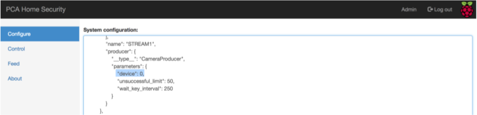

# Útmutató

Készítette: Török Máté

Módosította és kiegészítette: Nagy Bálint Máté

## Előkészület

Javasolt egy Linux gép használata egy web kamerával. A program Raspberry Pi-ra készült de például MacOsx alatt fejlesztettem (a továbbfejlesztés pedig Ubuntu alatt történt), tehát a lényeg, hogy ha lehet Unix gépről dolgozzunk. Python 3 szükséges hozzá és a `requirements.txt`-ben megadott pip package-ek.

Megjegyzés: 
- Az RPi.GPIO csomag csak Raspberry Pi eszközön fog sikeresen feltelepülni, de ez hagyományos számítógépen történő teszteléskor nem is gond
- A cryptography csomag telepítéséhez szükség lehet a következő programok telepítésére: `sudo apt-get install build-essential libssl-dev libffi-dev python-dev`

## Telepítés

### Klónozás és környezet beállítása

```bash
mt:mt MT\$ git clone https://github.com/MTTRK/RaspberryPi_Security.git
Cloning into 'RaspberryPi_Security'...
...
Resolving deltas: 100% (528/528), done.
mt:mt MT\$ python3 --version
Python 3.6.
mt:mt MT\$ pip3 --version
pip 9.0.3 from /usr/local/lib/python3.6/site-packages (python 3.6)
mt:mt MT\$ pip3 install virtualenv
Requirement already satisfied: virtualenv in /usr/local/lib/python3.6/site-packages
mt:mt MT\$ ls
RaspberryPi_Security
```

Látható, hogy sikeresen lehúztuk a repository-t. Ezenkívül rendelkezünk Python3-al (3.6.5) és pip3-al is, sőt feltelepítettük a virtualenv-et is.

### Pip packagek telepítése virtualenv használatával

```bash
mt:mt MT\$ cd RaspberryPi_Security/
mt:RaspberryPi_Security MT\$ ls
README.md config make.sh raspberry_sec requirements.txt
mt:RaspberryPi_Security MT\$ virtualenv rpi_env
Using base prefix '/usr/local/Cellar/python/3.6.5/Frameworks/Python.framework/Versions/3.6'
New python executable in /private/var/tmp/mt/RaspberryPi_Security/rpi_env/bin/python3.
Also creating executable in /private/var/tmp/mt/RaspberryPi_Security/rpi_env/bin/python
Installing setuptools, pip, wheel...done.
mt:RaspberryPi_Security MT\$ ls
README.md config make.sh raspberry_sec requirements.txt rpi_env
mt:RaspberryPi_Security MT\$ source rpi_env/bin/activate
(rpi_env) mt:RaspberryPi_Security MT\$ python --version
Python 3.6.
```

Mivel pip3-al telepítettük a virtualenv-et, azt használva Python3-at fogunk használni, de ez egyébként konfigurálható a `–p` kapcsolóval is (`virtualenv --help`).

```bash
(rpi_env) mt:RaspberryPi_Security MT\$ pip list
Package Version
---------- -------
pip 10.0.
setuptools 39.1.
wheel 0.31.
(rpi_env) mt:RaspberryPi_Security MT\$ pip install -r requirements.txt
Collecting opencv-python==3.3.0.10 (from -r requirements.txt (line 1))
Using cached
...
Installing collected packages: numpy, opencv-python, opencv-contrib-python, py, pytest,
tornado, scrypt, six, protobuf, werkzeug, tensorflow, pyyaml, scipy, keras, h5py, scikit-
learn, sklearn
Successfully installed h5py-2.7.1 keras-2.1.2 numpy-1.14.3 opencv-contrib-python-3.3.0.
opencv-python-3.3.0.10 protobuf-3.5.2.post1 py-1.5.3 pytest-3.2.2 pyyaml-3.12 scikit-learn-
0.19.1 scipy-1.1.0 scrypt-0.8.6 six-1.11.0 sklearn-0.0 tensorflow-1.1.0 tornado-4.5.
werkzeug-0.14.
(rpi_env) mt:RaspberryPi_Security MT\$ pip list
Package Version
--------------------- -----------
h5py 2.7.
Keras 2.1.
numpy 1.14.
opencv-contrib-python 3.3.0.
opencv-python 3.3.0.
pip 10.0.
protobuf 3.5.2.post
py 1.5.
pytest 3.2.
PyYAML 3.
scikit-learn 0.19.
scipy 1.1.
scrypt 0.8.
setuptools 39.1.
six 1.11.
sklearn 0.
tensorflow 1.1.
tornado 4.5.
Werkzeug 0.14.
wheel 0.31.
```

Látható, hogy sikeresen feltelepítettük pip-el a packageket.

### UI beállítása (SSL tanusítvány és Admin jelszó)

```bash
(rpi_env) mt:passwd MT\$ pwd
/var/tmp/mt/ RaspberryPi_Security/raspberry_sec/ui/resource/passwd
(rpi_env) mt:passwd MT\$ ls
setup_admin.py setup_admin.sh
(rpi_env) mt:passwd MT\$ sudo setup_admin.sh
Password:
Enter your password please:
Repeat it please:
(rpi_env) mt:passwd MT\$ ls
passwd setup_admin.py setup_admin.sh
(rpi_env) mt:passwd MT\$ cat passwd
...
```

Azért root-ként javasolt futtatni, mert akkor ő lesz a tulajdonos, és read jogokat adva csak olvasni lehet ezt a hash-t, de megváltoztatni semmiképp nem mert a service úgyse root-ként fog futni (és write joga másnak nincs). A UI itt fogja keresni a jelszó-fájlt szóval itt helyben futtassuk a scriptet, pont ahogy én tettem.

```bash
(rpi_env) mt:ssl MT\$ pwd
/var/tmp/mt/ RaspberryPi_Security/raspberry_sec/ui/resource/ssl
(rpi_env) mt:ssl MT\$ ls
setup_https.sh
(rpi_env) mt:ssl MT\$ sudo setup_https.sh
Password:
The IP address (domain name) I am creating the certificate for?
localhost
chmod: root\*: No such file or directory
chmod: server\*: No such file or directory
chmod: v3\*: No such file or directory
rm: root\*: No such file or directory
rm: server\*: No such file or directory
rm: v3\*: No such file or directory
Generating RSA private key, 2048 bit long modulus
....
Generating a 2048 bit RSA private key
...
writing new private key to 'server.key'
-----
Signature ok
subject=/C=HU/ST=Hungary/L=Budapest/O=PCA
Corp./OU=HomeSec/emailAddress=info@pca.com/CN=localhost
Getting CA Private Key
(rpi_env) mt:ssl MT\$ ls
rootCA.key rootCA.srl server.csr server.key v3.ext
rootCA.pem server.crt server.csr.config setup_https.sh
```

Amint látjuk, sikeresen létrejött a rootCA-nk és a szerverünk saját tanusítványa, amit SSL/TLS-re fog használni, hogy titkosított kommunikáció legyen a kliensek és a szerver között. Most _localhost_-ra készítettem a tanusítványt.

### NN Recognizer modul beállítása

GitHub méret korlátai miatt, csak két darabban tudtam feltölteni a fájlt (normális esetben ezt nem tenném meg, hiszen ez egy generálható modell, ráadásul saját használatra van, de a diplomaterv miatt, most nem szeretném a tesztelőt arra kényszeríteni, hogy saját modellt kelljen építenie egy gyors teszthez).

```bash
(rpi_env) mt:resources MT\$ pwd
/var/tmp/mt/ RaspberryPi_Security/raspberry_sec/module/nnrecognizer/resources
(rpi_env) mt:resources MT\$ ls
model.z01 model.zip
(rpi_env) mt:resources MT\$ cat \* > model_all.zip
(rpi_env) mt:resources MT\$ ls -l
total 405552
- rw-r--r-- 1 MT wheel 67108864 May 15 21:48 model.z
- rw-r--r-- 1 MT wheel 36709751 May 15 21:48 model.zip
- rw-r--r-- 1 MT wheel 103818615 May 15 22:19 model_all.zip
(rpi_env) mt:resources MT\$ unzip model_all.zip
Archive: model_all.zip
warning [model_all.zip]: zipfile claims to be last disk of a multi-part archive;
attempting to process anyway, assuming all parts have been concatenated
together in order. Expect "errors" and warnings...true multi-part support
doesnt exist yet (coming soon).
warning [model_all.zip]: 67108864 extra bytes at beginning or within zipfile
(attempting to process anyway)
file #1: bad zipfile offset (local header sig): 67108868
(attempting to re-compensate)
inflating: model.h5py
(rpi_env) mt:resources MT\$ ls
model.h5py model.z01 model.zip model_all.zip
```

Tehát a két partial zip-et egy nagy fájlba dumpoltam és aztán azt a nagy fájlt (model_all.zip) kitömörítettem.

## Szoftver elindítása

```bash
(rpi_env) mt:ui MT\$ pwd
/var/tmp/mt/ RaspberryPi_Security/raspberry_sec/ui
(rpi_env) mt:ui MT\$ python main.py
```

Egyelőre még nem látunk semmit, nyissunk egy böngészőt: <https://localhost:8080>


Ha beütünk valami rossz jelszót a fenti vörös üzenet fogad minket, de ha az előbb beállított admin jelszót adjuk meg akkor belépünk és ezt a log is megerősíti.

```
[INFO]:[2018- 05 - 15 22:25:43,994]:[MainProcess,MainThread]:tornado.access - 302 GET / (::1) 1.40ms
[INFO]:[2018- 05 - 15 22:25:43,999]:[MainProcess,MainThread]:LoginHandler - Handling GET message
[INFO]:[2018- 05 - 15 22:25:44,005]:[MainProcess,MainThread]:tornado.access - 200 GET /login?next=%2F (::1) 7.41ms
[INFO]:[2018- 05 - 15 22:25:44,036]:[MainProcess,MainThread]:tornado.access - 200 GET
/static/css/dashboard.css?v=b7a77cf1c265dc18bd2d79ec06da2077 (::1) 10.34ms
[INFO]:[2018- 05 - 15 22:25:44,042]:[MainProcess,MainThread]:tornado.access - 200 GET
/static/css/login.css?v=09678ef2873700bc9a5eb234febb7b6e (::1) 1.27ms
[INFO]:[2018- 05 - 15 22:25:44,210]:[MainProcess,MainThread]:tornado.access - 200 GET
/static/js/app.js?v=9f2e6253e2023598898903509cc3f0aa (::1) 1.95ms
[INFO]:[2018- 05 - 15 22:25:44,237]:[MainProcess,MainThread]:tornado.access - 200 GET
/static/img/pilogo.png?v=e15c3995dd9a65699d7ab4bc60bbbbf8 (::1) 2.37ms
[INFO]:[2018- 05 - 15 22:25:44,586]:[MainProcess,MainThread]:tornado.access - 200 GET
/static/img/pca.png?v=db40c2effdfa19b778ab6297441a8ca5 (::1) 0.83ms
[INFO]:[2018- 05 - 15 22:27:58,340]:[MainProcess,MainThread]:LoginHandler - Handling POST message
[INFO]:[2018- 05 - 15 22:27:58,340]:[MainProcess,MainThread]:LoginHandler - Checking credentials
[INFO]:[2018- 05 - 15 22:27:58,441]:[MainProcess,MainThread]:tornado.access - 302 POST /login (::1) 101.57ms
[INFO]:[2018- 05 - 15 22:27:58,446]:[MainProcess,MainThread]:LoginHandler - Handling POST message
[INFO]:[2018- 05 - 15 22:27:58,446]:[MainProcess,MainThread]:LoginHandler - Checking credentials
[INFO]:[2018- 05 - 15 22:27:58,532]:[MainProcess,MainThread]:tornado.access - 302 POST /login?next=%2F (::1) 86.51ms
[INFO]:[2018- 05 - 15 22:27:58,536]:[MainProcess,MainThread]:MainHandler - Handling GET message
[INFO]:[2018- 05 - 15 22:27:58,538]:[MainProcess,MainThread]:tornado.access - 200 GET / (::1) 2.50ms
[INFO]:[2018- 05 - 15 22:27:58,543]:[MainProcess,MainThread]:MainHandler - Handling GET message
[INFO]:[2018- 05 - 15 22:27:58,544]:[MainProcess,MainThread]:tornado.access - 200 GET / (::1) 1.39ms
[INFO]:[2018- 05 - 15 22:27:58,569]:[MainProcess,MainThread]:tornado.access - 200 GET
/static/css/dashboard.css?v=b7a77cf1c265dc18bd2d79ec06da2077 (::1) 1.74ms
[INFO]:[2018- 05 - 15 22:27:58,579]:[MainProcess,MainThread]:tornado.access - 200 GET
/static/css/login.css?v=09678ef2873700bc9a5eb234febb7b6e (::1) 2.11ms
```

Talán a legjobb kis teszt ha elindítjuk a rendszert és megnézzük a kamera képet, valamint ha emailt is akarunk kapni, érdemes annak a modulnak is a konfigurációját módosítani:


Látszik, hogy be tudjuk állítani kinek menjen az értesítés és azt is, hogy kitől (mt.raspberry.pi@google.com egy általunk létrehozott google-fiók, jelszó is van hozzá természetesen, de azt repository-ba nem kommitáltuk be, ezért se látható a jelenlegi konfigurációban).

Ha esetleg nem a 0-ik device lenne a kamera, akkor mindkét jelenleg bekonfigurált stream-nél azt még be kell állítani, így le kell görgetni az alábbi részekhez (két stream van, tehát két ilyen is van):



Amint megvagyunk a módosítással, a Save gombra kattintva lementetthetjük a rendszerrel az új konfigurációt, amit a legközelebbi start-upnál fel fog olvasni.

Indítsuk el és nézzük meg a logot majd a kamera képét is:


## Recognizer modulok tanítása

A tanításhez szükség van a megfelelő helyeken fotókra.

```bash
(rpi_env) mt:facerecognizer MT\$ pwd
/var/tmp/mt/ RaspberryPi_Security/raspberry_sec/module/facerecognizer
(rpi_env) mt:facerecognizer MT\$ ls
**init**.py **pycache** consumer.py resources test.py
(rpi_env) mt:facerecognizer MT\$ ls resources/
eigen.yml haarcascade_frontalface_default.xml lbph.yml
fisher.yml labels.json train
(rpi_env) mt:facerecognizer MT\$ ls resources/ train /
mate_c mate_f yalefaces
(rpi_env) mt:facerecognizer MT\$ python test.py -h
usage: test.py [-h][-p] [-w WHO][-tr]

== Face Recognizer (testing/training module) ==

optional arguments:
- h, --help show this help message and exit
- p, --produce If training data should be produced (no training/testing)
- w WHO, --who WHO For whom the data should be produced (only with -p)
- tr, --training If training should be conducted before testing
```

Most pedig futassuk `–tr` flag-el:

```bash
mt:facerecognizer MT\$ python test.py -tr
2018 - 05 - 15 23:02:44,725:FacedetectorConsumer:INFO - Initializing component
2018 - 05 - 15 23:02:44,810:FacedetectorConsumer:INFO - Face detected
2018 - 05 - 15 23:02:46,241:FacedetectorConsumer:DEBUG - Could not detect any faces
2018 - 05 - 15 23:02:46,250:FacedetectorConsumer:DEBUG - Could not detect any faces
2018 - 05 - 15 23:02:46,266:FacedetectorConsumer:DEBUG - Could not detect any faces
2018 - 05 - 15 23:02:46,283:FacedetectorConsumer:INFO - Face detected
...
```

Itt tulajdonképpen az történik, hogy a training előtt felolvassuk a képeket, pre-processzáljuk őket (size, color, face-detection, labelling) és utána továbbadjuk a training metódusoknak. Ezután elindul a tényleges testing is, ami mint már a dolgozatban rámutattam, egészen manuális (kamerakép mutatja aktuális detectált arcot és az ID-t akivel azonosította).

Most nézzük meg hasonlóképpen a neurális háló modul training/test-jét:

```bash
(rpi_env) mt:nnrecognizer MT\$ pwd
/var/tmp/mt/RaspberryPi_Security/raspberry_sec/module/nnrecognizer
(rpi_env) mt:nnrecognizer MT\$ ls resources/
model.h5py model.z01 model.zip model_all.zip train
(rpi_env) mt:nnrecognizer MT\$ ls resources/train/
neg pos
(rpi_env) mt:nnrecognizer MT\$ python test.py -h

/private/var/tmp/mt/RaspberryPi_Security/rpi_env/lib/python3.6/site-packages/h5py/**init**.py:36: FutureWarning:
Conversion of the second argument of issubdtype from `float` to `np.floating` is deprecated. In future, it will
be treated as `np.float64 == np.dtype(float).type`.
from .\_conv import register_converters as \_register_converters
Using TensorFlow backend.
usage: test.py [-h][-tr] [-d][-u]

== NN Face Recognizer (testing/training module) ==

optional arguments:
- h, --help show this help message and exit
- tr, --training If training should be conducted before testing
- d, --detect If the input should go under face-detection (only with -tr)
- u, --update If the input should be updated with the face that has been detected (only with -d)
```

Ott van a két mintahalmaz. Most pedig indítsuk el a training-elést.

A `–d` és `–u` kapcsolók a pre-processzinghez tartoznak.

Ezek lényegében azt a célt szolgálják, hogy ha pl. egy teljes alakos embert képet akarunk felhasználni akkor ahhoz először mindenképp arcot kell detektáljunk és utána mentsük is természetesen le az "új" képet. Nos a kapcsolók ennek irányítására szolgálnak. Én most tehát nem fogom őket használni és csak simán a `–tr` flag-el fogom futtatni a programot (lassú folyamat, hiszen kb. 6000 kép minta van és hát egy neurális háló is, szóval maximum ha GPU is áll rendelkezésre, tensorflow backend telepítve van packagek között):

```bash
(rpi_env) mt:nnrecognizer MT\$ python test.py -tr
/private/var/tmp/mt/RaspberryPi_Security/rpi_env/lib/python3.6/site-
packages/h5py/**init**.py:36: FutureWarning: Conversion of the second argument of issubdtype
from `float` to `np.floating` is deprecated. In future, it will be treated as `np.float64 ==
np.dtype(float).type`.
from .\_conv import register_converters as \_register_converters
Using TensorFlow backend.
Class: 0 --> resources/train/neg
Class: 1 --> resources/train/pos

...
Total params: 9,275,
Trainable params: 9,275,
Non-trainable params: 0

Train on 4796 samples, validate on 1599 samples

#192/4796 [>.............................] - ETA: 25:52 - loss: 0.4043 - acc: 0.
...
```

## A távoli elérést biztosító rendszer konfigurálása
Az eszköz távoli eléréséhez a megfelelő Google Cloud Platform környezet kialakítása, és ide a https://github.com/nagybalint/iot-home-security-firebase repo által tartalmazott kód feltöltése szükséges.

### Firebase projekt létrehozása
Első lépésként hozzunk létre egy Firebase projektet, melyhez egy Google account szükséges. A projekt létrehozása a következő oldalon lehetséges: https://console.firebase.google.com/. A projekt szabadon elnevezhető (a projekt neve szerepelni fog annak azonosítójában, melyre később még szükség lesz), az Analytics Location számára a United States, a Cloud Firestore Location számára a us-central értéket állítsuk be.

Az általam létrehozott projekt az iot-home-security-d018f azonosítót kapta, a későbbi példákban is ez fog szerepelni, az alább szerplő linkekben és konfigurációs beállításokban a saját projekt azonosítójával helyettesítendő.

Ahhoz, hogy a projekt kiegészíthetővé váljon a Google Cloud Platform szolgáltatásaival, szükséges a projekthez a Blaze (pay as you go) Plan beállítása. Ehhez szükség lesz bankkártyaadatok megadására, azonban anyagi teher nagy valószínűség szerint a fejlesztés során nem fog keletkezni: a szolgáltatások ingyenes használatához rendelkezésre álló keretek többnyire olyan magasak, hogy azok elérése irreális. (Ez alól kivételt az IoT Core jelenthet, itt nagyon jó minőségben tönörített kameraképek küldése esetén könnyen lehetséges a kvóta túllépése, ami 250 MB adatforgalom per naptári hónap. Ezért tanácsos az eszköz által küldött státuszüzenetekhez 10-25 tömörítési minőségű JPEG képeket beállítani).

### A szükséges API-k engedélyezése
Amint elkészült a Blaze Plant használó Firebase projekt, a rendszer működéséhez szükséges API-k engedélyezése következik. Ehhez látogassunk el a https://console.cloud.google.com/apis/dashboard?project=iot-home-security-d018f oldalra.

Kattintsuk az oldal fejlécében található Enable APIs and Services gombra, és engedélyezzük a következőket:
- Google Cloud IoT API
- Cloud Pub/Sub API

### Service account létrehozása
Ahhoz, hogy a Firebase képes legyen az IoT Core elérésére, egy Service Account elkészítése szükséges. Az https://console.cloud.google.com/iam-admin/serviceaccounts?folder=&organizationId=&project=iot-home-security-d018f oldalon kattintsunk a fejlécben található Create Service Account gombra.

A service accountnak tetszőleges név adható (például cloud-iot-core, hiszen az ehhez való hozzáférésre szolgál), az oldal által felajánlott azonosítót fogadjuk el bátran. Az account számára leírás opcionálisan adható, például: "Admin service account for managing cloud iot core".

A következő oldalon adjuk hozzá a Cloud IoT Admin role-t, majd ismét a következő oldalra navigálva a Create Key gomb megnyomásával JSON formátumban töltsük le a Service Account azonosítóit, illetve a hozzá tartozó privát kulcsot. A fájl tárolása során nagy körültekintéssel kell eljárni (például githubra ne kerüljön fel!), mert annak birtokában az IoT Core szolgáltatás használata bárki számára admin jogosultságokkal lehetséges.

### A távoli elérést megvalósító szoftver feltöltése a projektbe
A https://github.com/nagybalint/iot-home-security-firebase repoból klónozzuk le a távoli elérést biztosító rendszer felhő alapú komponensének forrását.

```
nagybalint@tp13ubi:~/code/thesis-attachment/sources $ git clone https://github.com/nagybalint/iot-home-security-firebase
```

A `functions` mappába másoljuk be az imént letöltött service account fájlt `service-account-iot-core.json` néven.

```
nagybalint@tp13ubi:~/code/thesis-attachment/sources/iot-home-security-firebase/functions (master)$ ls
add_device.js       index.js      package-lock.json   register_mobile_user.js  send_push_notification.js      update_device_status.js
fetch_device_id.js  package.json  register_device.js  send_command.js          service-account-iot-core.json  validate_https_token.js
```

A forrás Firebase projektbe való feltöltése egy erre a célra szolgáló program segítségével lehetséges. Ennek telepítéséhez futtassuk az `npm install -g firebase-tools` parancsot. A telepítést követően a `firebase login` parancs futtatásával jelentkezzünk be, majd válasszuk ki az előbb létrehozott projektet a `firebase use --add` parancs futtatásával.

```
nagybalint@tp13ubi:~/code/thesis-attachment/sources/iot-home-security-firebase/functions (master)$ firebase use --add
? Which project do you want to add? iot-home-security-d018f
? What alias do you want to use for this project? (e.g. staging) prod

Created alias prod for iot-home-security-d018f.
Now using alias prod (iot-home-security-d018f)
```

A szoftver feltöltése ezek után a `firebase deploy` parancs futtatásával végezhető el.

Részletes útmutató: https://firebase.google.com/docs/hosting/quickstart

## Az IoT Home Security mobilalkalmazás konfigurálása
Ahhoz, hogy a mobilalkalmazást fel tudjuk használni a PCA eszköz távoli elérésére, először szükséges annak a felkonfigurálása, majd a megfelelő platformra történő lefordítása.

### Az alkalmazás fejlesztéséhez és fordításához szükséges környezet felépítése
Az fejlesztéshez és fordításhoz használt környezet felépítése a https://facebook.github.io/react-native/docs/getting-started oldal React Native CLI Quickstart tabján a megfelelő fejlesztő és mobil platform kiválasztása után az Installing Dependencies fejezet lépéseit követve lehetséges.

Az Android platformon az Android SDK 28-as változatával történt a fejlesztés és tesztelés, így ezt mindenképp szükséges telepíteni a környezet felépítése során.

### A szoftver konfigurálása
Klónozzuk le a mobilalkalmazás forrását a https://github.com/nagybalint/iot-home-security-app repóból.

```
nagybalint@tp13ubi:~/code/thesis-attachment/sources $ git clone https://github.com/nagybalint/iot-home-security-app.git
```

Az `iot-home-security-app/IoT_Home_Security/config/firebase.json` fájl `"functions_base_url"` paraméterét állítsuk az előző pontban létrehozott, https Firebase Cloud Functions függvények elérési útjára.

```
nagybalint@tp13ubi:~/code/thesis-attachment/sources/iot-home-security-app (master)$ cat config/firebase.json 
{ 
    "functions_base_url": "https://us-central1-iot-home-security-d018f.cloudfunctions.net"
}
```

Az repo gyökérkönyvtárában állva az `npm install` parancs kiadásával telepsítsük fel a  szükséges csomagokat.

```
nagybalint@tp13ubi:~/code/thesis-attachment/sources/iot-home-security-app (master)$ npm install
```

### Az alkalmazás lefordítása Android platformra
A létrehozott Firebase projekt oldalán adjunk hozzá egy Android alkalmazást. Az https://console.firebase.google.com/project/iot-home-security-d018f/overview oldalon kattintsunk az alkalmazások hozzáadása résznél az Android ikonra, majd kövessük a felugró ablak által megjelenített utasításokat. A folyamat során szüksége van az alkalmazás Android csomagjának nevéve, mely com.iot_home_security.

A Next gomb megnyomása után megjelenő képernyő felkínálja a google-services.json fájl letöltésének lehetőségét. Mentsük el a fájlt, majd lépjünk a következő képernyőre.

A képernyőn látható, az alkalmazás Android platformra történő lefordításához szükséges változtatások már elvégzésre kerültek, lépjünk tovább. Az utolsó lépésként a Google megpróbálja felvenni a kapcsolatot az alkalmazással. Ez az alkalmazás Android platformra történő lefordításáig nem fog sikerülni, így nyomjuk meg a Skip this step gombot.

Az imént letöltött google-service.json fájlt másoljuk be a `iot-home-security-app/IoT_Home_Security/android/app/google-services.json` mappába (írjuk felül az ott található, az iot-home-security-d018f projektet tartalmazó, megegyező nevű fájlt).

Az alkalmazás teszteléséhez veló előkészületként végezzük el a https://facebook.github.io/react-native/docs/getting-started#preparing-the-android-device oldalon bemutatott lépéseket.

Végezetül az alkalmazás konfigurálásának sikeressége a `react-native run-android` parancs kiadásával egy valós, vagy virtuális Android eszközön ellenőrizhető.

Az alkalmazás Android platfromra történő lefordítása a következő útmutató alapján lehetséges: https://facebook.github.io/react-native/docs/signed-apk-android. Az alkalmazás fordításának végén előáll a belőle készült apk fájl.

### Az alkalmazás konfigurálása iOS platform számára
Az alkalmazás iOS platformon történő kipróbálásához egy Mac és egy (valódi vagy virtuális) iPhone használata szükséges. A fejlesztés során ezek nem álltak rendelkezésre, így az alkalmazás iOS plaformon történő futtatása előtt annak konfigurálását teljes egészében el kell végezni.

A létrehozott Firebase projekt oldalán adjunk hozzá egy iOS alkalmazást a https://console.firebase.google.com/project/iot-home-security-d018f/overview oldalon. Az alkalmazás forrása iOS plaformra nem került konfigurálásra, így pontosan kövessük az összes lépést.

Végezzük el a React Native Firebase csomag következő moduljainak iOS alapú telepítési útmutatóját, melyek a következő oldalról érhetők el: https://rnfirebase.io/docs/v5.x.x/getting-started
- Authentication
- Cloud Firestore
- Cloud Functions
- Cloud Messaging
- Notifications
- Storage

A csomagok telepítése után az alkalmazás a https://facebook.github.io/react-native/docs/getting-started#running-your-react-native-application-1 oldalon található lépések segítségével tesztelhető.

## MQTT kapcsolat konfigurálása a PCA rendszerben
Az MQTT kapcsolat konfigurálása a PCA rendszerben az eszköz regisztálásához, illetve konfigurációjához használató fájl elkészítésével történik.

Az alábbiakban szereplő lépések elvégzéséhez a következő programok telepítése szükséges:
- gcloud-cli - A telepítéshez kövessük a következő oldalon szereplő lépéseket: https://cloud.google.com/sdk/docs/#deb
- jq - `sudo apt install jq`

### Konfigurációs fájl elkészítése
Módosítsuk az `iot-home-security/src/config/test/mqtt_session_test.json` fájlt a következőképpen:
- project_id: A létrehozott Firebase projekt azonosítója
- registry_id: A létrehozandó IoT Core registry neve. Értéke szabadon megválasztható
- device_id: A PCA eszköz leendő neve. Szabadon megválaszható.
- verification_code: A PCA eszközhöz tartozó ellenőrző kód. Szabadon megválaszható, érdemes erős kódot beállítani

### Az eszköz regisztrációja az IoT Core-ba
A `gcloud init` parancs futtatásával jelentkezzünk be a programba és válasszuk ki a létrehozott Firebase projektet.

A `create_registry.sh` script a registry létrehozását, a `register_device.sh` pedig az eszköz azonosítóinak legenerálását, illetve regisztrálását végzi el.

```
nagybalint@tp13ubi:~/code/iot-home-security/src/raspberry_sec/mqtt/admin_utils (develop)$ ./create_registry.sh -e test -c mqtt_session_test.json
nagybalint@tp13ubi:~/code/iot-home-security/src/raspberry_sec/mqtt/admin_utils (develop)$ ./register_device.sh -e test -c mqtt_session_test.json -u  https://us-central1-iot-home-security-d018f.cloudfunctions.net/register_device
```

A távoli elérést biztosító rendszer ezen lépesek után használható, használatához a PCA rendszer MQTT kommunikációt tartalmazó konfigurációs fájljaiban a megfelelő projekt, registry és eszközadatok megadása szükséges.